# AV Spex Help

AV Spex is a macOS application written in Python that helps process digital audio and video media created from analog sources. It confirms that digitized files conform to predetermined specifications and performs automated preservation actions: fixity checks, access file creation, metadata sidecars, and HTML reports.

Designed for audiovisual preservation workflows, AV Spex was developed with support from the Smithsonian's National Museum of African American History and Culture (NMAAHC).

---

## Quick Start

### Install (Homebrew)
```bash
brew tap JPC-AV/AV-Spex
brew install av-spex
```

### Launch the GUI
```bash
av-spex-gui
```

### Run on a directory
```bash
av-spex /path/to/video_files
```

---

## Requirements

macOS 13 (Ventura) and up

### Required Command Line Tools

The following command line tools must be installed separately. The macOS package manager [Homebrew](https://brew.sh/) is recommended:

- **[ExifTool](https://exiftool.org/)** — embedded metadata extraction
- **[FFmpeg](https://www.ffmpeg.org/)** — stream analysis, access file creation, stream hashing
- **[MediaConch](https://mediaarea.net/MediaConch)** — policy-based conformance validation
- **[MediaInfo](https://mediaarea.net/en/MediaInfo)** — container and stream metadata extraction
- **[MKVToolNix](https://mkvtoolnix.download/)** — a set of tools to create, alter and inspect Matroska files
- **[QCTools](https://bavc.org/programs/preservation/preservation-tools/)** — per-frame video quality analysis
- **[mkvalidator](https://www.matroska.org/downloads/mkvalidator.html)** — verifies Matroska and WebM files for spec conformance

Install with Homebrew:
```bash
brew install exiftool ffmpeg mediaconch mediainfo mkvtoolnix qcli mkvalidator
```

The AV Spex GUI checks for all required dependencies at startup.

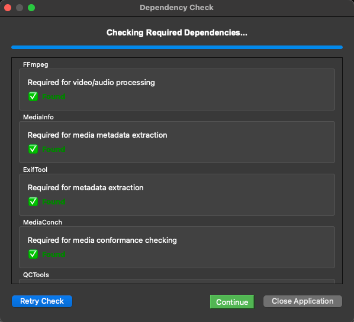

---

## Installation

There are three installation options:

### 1. DMG (Recommended)

Download the installer from the [latest release](https://github.com/JPC-AV/JPC_AV_videoQC/releases/latest).

### 2. Homebrew

```bash
brew tap JPC-AV/AV-Spex
brew install av-spex
```

Verify the installation:
```bash
av-spex --help
```

### 3. From Source

Python 3.10 or higher is required.

Creating a virtual environment is optional but recommended to avoid system-wide package conflicts.

**Using venv:**

```bash
python3 -m venv name_of_env
source ./name_of_env/bin/activate
```

**Using Conda:**

1. Install: `brew install --cask anaconda`
2. Add to PATH: `export PATH="/opt/homebrew/anaconda3/bin:$PATH"` (Apple Silicon) or `export PATH="/usr/local/anaconda3/bin:$PATH"` (Intel)
3. Initialize: `conda init zsh`
4. Create environment: `conda create -n JPC_AV python=3.10.13`

Then install AV Spex:

```bash
cd path-to/JPC_AV_videoQC
pip install .
av-spex --help
```

---

## GUI Usage

If using the homebrew/cli version, launch the GUI with the command:
```bash
av-spex-gui
```

The GUI has four tabs: **Import**, **Checks**, **Spex**, and **Complex**

### Import Tab

The Import tab is where you select input directories for processing and manage configuration files. It includes options to import, export, or reset the Checks and Spex configurations as JSON files.

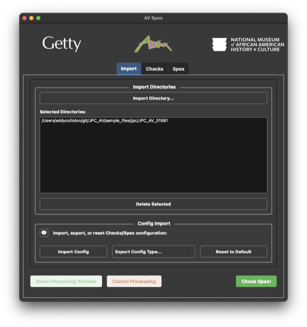

#### Import and Export Config

The **Export Config** dropdown saves your current settings to a JSON file. Choose what to export from the dropdown, then pick a save location:

- **Checks Config** — only which tools run and how (fixity settings, run/check toggles, output options)
- **Spex Config** — only the expected values used for validation (codecs, formats, naming conventions, etc.)
- **Spex and Checks Config** — both of the above in one file
- **Custom profiles** — your custom Checks, ExifTool, MediaInfo, FFprobe, Filename, or Signal Flow profiles, for sharing with other users
- **All Config** — everything, including custom profiles

The **Import Config** button loads settings from a JSON file created by the Export feature. Importing Checks or Spex settings replaces the matching values in your current configuration. Imported custom profiles are added alongside your existing ones; if an imported profile has the same name as one you already have, it is added with an `(imported)` suffix rather than overwriting yours.

The **Reset to Default** button restores all settings to the application's built-in defaults. This cannot be undone.

**Example:** Suppose you have tuned the Checks and Spex settings for a collection of NTSC U-matic transfers and want a colleague to process a batch with identical settings. Select **Export Spex and Checks Config** from the Export dropdown and save the JSON file, then send it to your colleague. On their machine they click **Import Config**, choose that file, and their AV Spex now runs the same tools and validates against the same expected values as yours. When they later move on to a different collection, **Reset to Default** returns AV Spex to its shipped configuration.

### Checks Tab

The Checks tab controls which tools and processing steps are run. It includes:

- **Checks Profiles**: Apply a preset profile that configures a predefined set of tool options.
  - **Step 1**: Run and check ExifTool, FFprobe, MediaInfo, MediaTrace, mkvalidator, and MediaConch; embed and output fixity
  - **Step 2**: Run QCTools and qct-parse (bar detection, evaluate bars, thumbnail export, audio analysis, clamped levels, chroma phase errors) plus CLAMS bars/tone detection and frame analysis (bitplane check, border detection, BRNG, signalstats); check fixity and validate stream fixity; generate the HTML report
  - **Vendor**: Run the metadata tools and MediaConch without comparing them against Spex values, embed stream fixity, and generate the HTML report — for checking vendor-supplied files before the full QC pass
  - **Off**: Turn off all tools
- **Checks Options**: Enable or disable individual tools and checks using checkboxes. Each tool has a **Run Tool** option (generates a sidecar file) and a **Check Tool** option (compares the sidecar output against expected Spex values).

Click **Check Spex!** to start processing.

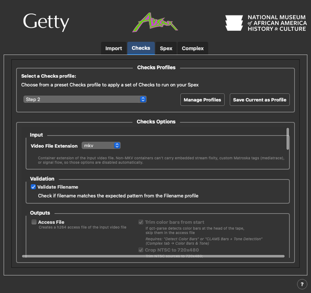

### Spex Tab

The Spex tab shows the expected metadata values that AV Spex validates against, as a grid of cards — one per category: **Filename**, **Signal Flow**, **MediaInfo**, **Exiftool**, **FFprobe**, and **qct-parse Thresholds**. Each card displays:

- A **profile dropdown** to select which saved profile is active for that category
- A **status line** stating the active profile. If you change expected values after applying a profile, the card honestly reports *Modified from "profile name"* rather than silently deselecting; if no profile has been recorded yet it reads *No profile recorded — showing current values*
- A one-line **summary** of the key expected values (e.g. `FFV1 · 720×486 · Interlaced BFF`)
- **View** — opens a structured, read-only window listing every expected value for that category
- **Edit...** — modifies the selected custom profile. For the built-in default profiles this button becomes **Duplicate...**, which copies the profile's values into a new custom profile
- **New...** — creates a custom profile, starting from the current expected values
- **Delete** — removes the selected custom profile (disabled for built-in profiles)

The built-in default profiles cannot be overwritten or deleted. To change expected values — for example, to validate PAL transfers or a different audio codec — create your own custom profile with **New...** or **Duplicate...**. See the [Custom Metadata Profiles](#custom-metadata-profiles) section below for details.

The qct-parse Thresholds card is read-only; it summarizes the content thresholds and SMPTE color bars limits used by the qct-parse analyses.

The Signal Flow card is only available for MKV input, since the signal flow equipment chain is validated against embedded Matroska tags.

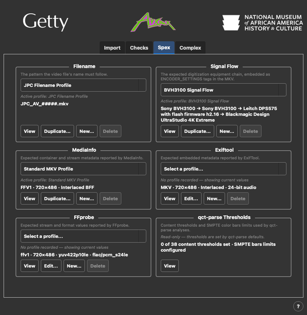

### Complex Tab

The Complex tab configures the advanced analysis steps — typically run during Step 2 or configured independently. Options are grouped by what they check, rather than by the tool that implements them:

- **QCTools Report**: Run QCTools on the input video to generate the per-frame report that many of the checks below read, and set the report's file extension (`qctools.xml.gz` or `qctools.mkv`). If a report already exists in the `_qc_metadata` or `_vrecord_metadata` directory, it is reused instead of re-running.
- **Color Bars & Tone**:
  - **Detect Color Bars**: Find SMPTE color bars in the video content (via qct-parse). The detected section is used downstream to skip bars in BRNG analysis and trim them from the access file. Its sub-options **Evaluate Color Bars** (compare program content against a reference — either this file's own detected bars or standard SMPTE values) and **Export Thumbnails** (save thumbnails of failing frames) become available when detection is on.
  - **CLAMS Bars + Tone Detection**: Run the CLAMS SSIM-based SMPTE bars detector and cross-correlation tone detector together as one step; results are compared side-by-side with qct-parse and merged into the head color-bars end time (described in the Color Bars & Tone section below)
- **Video Signal Checks** (each check is described in the Video Signal Checks section below):
  - **Detect Clamped Levels**: Broadcast-range level clamping from the analog-to-digital converter (via qct-parse)
  - **Detect Chroma Phase Errors**: Tape tracking artifacts where chroma collapses toward cyan or magenta (via qct-parse)
  - **Duplicate Frame Detection**: Runs of repeated frames likely caused by TBC or framesync errors
  - **Bitplane Check**: Verify that the 9th and 10th bits of 10-bit video contain data
  - **Border Detection**: Toggle on/off and select mode — simple (fixed pixel crop) or sophisticated (edge detection, with tunable parameters)
  - **Signalstats Analysis**: Enhanced FFprobe signalstats over the detected active area (requires Border Detection)
  - **BRNG Analysis**: Toggle on/off, set maximum analysis duration, and enable or disable automatic color bar skipping
  - **Analysis Periods**: The number and length of the time windows sampled across the video, shared by Signalstats and BRNG analysis
- **Audio Checks** (each check is described in the Audio Checks section below):
  - **Audio Analysis**: Clipping, channel imbalance, audible timecode (LTC), identical channel detection, and audio dropout (via qct-parse)
  - **Tone Leak Detection**: A 1 kHz reference tone leaking from the transfer chain, heard as a faint high-pitched whine or squeak in quiet passages (via qct-parse)
  - **Dropped Sample Detection**: Potential audio sample drops from TBC/framesync or ADC devices

Checks marked "via qct-parse" read the QCTools report through the qct-parse tool, and enabling any of them turns qct-parse on automatically — there is no separate qct-parse "Run Tool" checkbox on this tab. Turning off all qct-parse-backed checks turns the tool off.

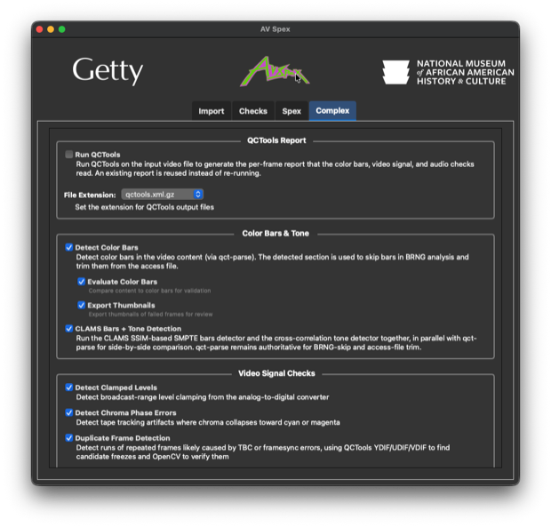

Once your Spex selections are complete, navigate to the Checks tab and click **Check Spex!**.

---

## Custom Metadata Profiles

AV Spex supports custom profiles for ExifTool, MediaInfo, and FFprobe. This is useful when processing collections with different technical specifications — for example, PAL vs. NTSC transfers, or FLAC vs. PCM audio.

Each card in the Spex tab includes:
- A **profile dropdown** to select from saved profiles
- **New...** to define a new set of expected values (pre-filled from the current ones)
- **Edit...** to modify an existing custom profile — or **Duplicate...** to copy a built-in profile into an editable custom one
- **Delete** to remove a custom profile

Default profiles are protected from modification and deletion — Edit becomes Duplicate and Delete is disabled for them. Custom profiles are saved to the user config directory and persist across sessions. Custom filename and signal flow profiles can be created, edited, and deleted the same way as the metadata tool profiles.

Multiple acceptable values can be defined for any field. For example, if a collection includes both FLAC and PCM audio, the expected `codec_name` can be set to `["flac", "pcm_s24le"]`.

Profiles can also be applied from the CLI:
```bash
av-spex --exiftool-profile "My ExifTool Profile"
av-spex --mediainfo-profile "My MediaInfo Profile"
av-spex --ffprobe-profile "My FFprobe Profile"
```

To view available profiles and current expected values:
```bash
av-spex -pp exiftool
av-spex -pp mediainfo
av-spex -pp ffprobe
```

---

## QCTools Report

The QCTools Report group on the Complex tab controls generation of the per-frame QCTools report — the sidecar file that the color bars, video signal, and audio checks below read.

- **Run QCTools** — Run QCTools (`qcli`) on the input video to generate the per-frame report. If a report already exists in the `_qc_metadata` or `_vrecord_metadata` directory, it is reused instead of re-running.
- **File Extension** — Set the extension for QCTools output files: `qctools.xml.gz` or `qctools.mkv`.

Checks described below as running "via qct-parse" read the QCTools report through the qct-parse tool rather than re-analyzing the video. Enabling any of them turns qct-parse on automatically; turning them all off turns the tool off.

---

## Color Bars & Tone


### Detect Color Bars

Detects SMPTE color bars in the video content (via qct-parse) by scanning the QCTools report for the signal signature of bars — steady near-peak luma and high chroma saturation held over consecutive frames. The detected section is written to `qct-parse_colorbars_durations.csv` and used downstream:

- BRNG analysis skips the bars at the head of the tape to avoid false positives
- The access file can be trimmed to start after the bars (**Trim Color Bars** output option)
- Chroma phase and duplicate frame detection exclude the bars region

When CLAMS Bars + Tone Detection is also enabled, the head-bars end time used for the BRNG skip and the access-file trim is merged from both detectors — the later end time wins (see the CLAMS section below).

### Evaluate Color Bars

Available when Detect Color Bars is on. Compares the program content against a reference set of color bar levels, flagging frames that exceed those levels. A summary and per-frame failures are written to CSVs and charted in the HTML report — as pie charts of the per-tag failure share, and as the timeline described below.

Use **Compare against** to choose the reference:

- **Bars detected in this video** (default): grades against the signal values measured from this file's own color bars. If no bars are found in the video, the standard SMPTE values are used as a fallback.
- **Standard SMPTE values**: always grades against the standard SMPTE color bar values from the config, ignoring any bars detected in the video. When bars are also detected, the report still charts the file's measured bars alongside the SMPTE reference for comparison.

### Timeline of Signal Distribution

The **Timeline of Signal Distribution** section of the HTML report charts the results of the color bars evaluation across the whole tape. It appears below the evaluation pie charts whenever the evaluation ran and found failing frames — the pies summarize *which* tags failed and in what proportion, and the timeline shows *where* those failures fall.

**Reading the chart**: The horizontal axis is elapsed time through the file; the vertical axis is the percentage of frames in each time interval whose value fell outside the reference threshold. Each failing tag gets its own line in a fixed color (the same tag is always the same color from report to report), so a cluster of failures reads as a peak and a clean stretch as a valley. Hovering over a line gives the time and the exact percentage for that interval.

- **YMAX / YMIN / UMAX / UMIN / VMAX / VMIN / SATMAX / SATMIN** — solid lines, each the share of frames whose luma, chroma, or saturation level exceeded the reference bars (or standard SMPTE) threshold.
- **BRNG** — a dashed line, drawn differently because it measures a different thing: the share of pixels in a frame that fell outside broadcast range, rather than a signal level. It is also the measure frame analysis uses to decide where to place its analysis periods, so the dashed line and the shaded bands below tend to coincide.

**Shaded bands** provide context for what the lines are doing:

- **Tan bands** — the periods sampled by frame analysis (Signalstats and BRNG analysis)
- **Dark gray bands** — detected black segments, which frame analysis avoids when placing its periods
- **Plum bands** (with a solid rule along the baseline) — detected color bars, which are excluded from the evaluation and therefore always read as zero failures

**Peak thumbnails**: Dotted vertical lines mark the largest failure clusters, with a representative frame from each cluster shown above the chart — out-of-range areas are highlighted in cyan. Clusters are chosen by failure density and kept apart from one another so the thumbnails illustrate distinct events rather than the same moment repeatedly. Clickable copies of the same thumbnails appear below the chart in time order, captioned with the timestamp, tag, measured value, and threshold; click one to enlarge it.

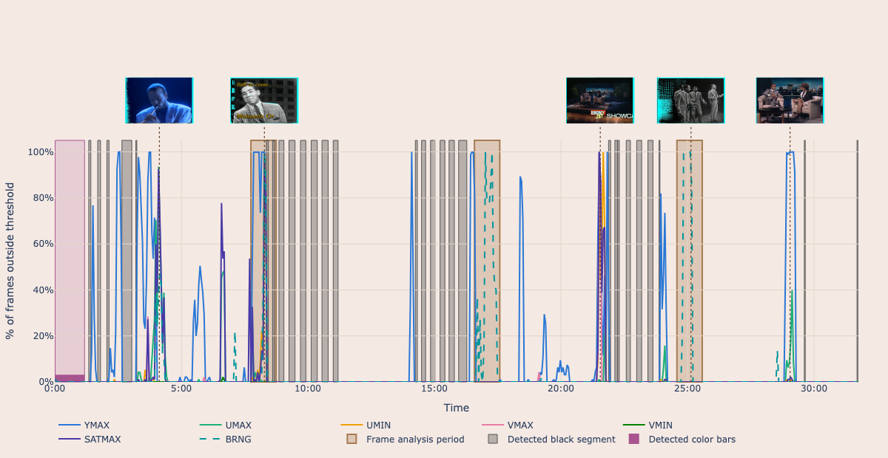

*The timeline for a half-hour tape. The plum band at the head marks the detected color bars, which the evaluation skips; the gray bands are detected black segments and the three tan bands are the periods sampled by frame analysis. YMAX (blue) accounts for most of the failures here, spiking to 100% of frames in brief bursts, while the dashed teal BRNG line rises alongside it around 17:00 and 21:30. Thumbnails above the plot show a representative frame from each of the five largest failure clusters, with out-of-range areas highlighted in cyan.*

**Show all failures**: An expandable table below the thumbnails lists every failing frame with its timestamp, tag, value, and threshold — the full contents of `qct-parse_colorbars_eval_failures.csv`.

Times along the timeline are elapsed time from the start of the file, not the file's own embedded timecode, so they may not line up exactly with an NLE's timecode display. The chart can be saved as a PNG using the camera icon in the Plotly toolbar at the top right of the plot.

### Export Thumbnails

Available when Detect Color Bars is on. Exports thumbnail images of frames that failed evaluation to the `ThumbExports/` directory for visual review.

### CLAMS Bars + Tone Detection

**CLAMS** (Computational Linguistics Applications for Multimedia Services) is an open-source project led by Brandeis University that builds reusable tools for analyzing audiovisual collections. AV Spex adapts two CLAMS apps — [app-barsdetection](https://github.com/clamsproject/app-barsdetection) and [app-tonedetection](https://github.com/clamsproject/app-tonedetection) — porting just their detection cores into the AV Spex pipeline (both distributed under the Apache License 2.0). The two detectors run together as a single step, before qct-parse, and their results both complement and feed into qct-parse's own bars detection.

**Bars detection**: Frames are sampled (every 30th frame by default) and converted to grayscale. Each sample is compared to a bundled SMPTE color bars reference image using structural similarity (SSIM). A frame matches when its SSIM score exceeds the primary threshold (0.7), and a run of consecutive matching samples becomes a detected bars span once it exceeds the minimum frame count.

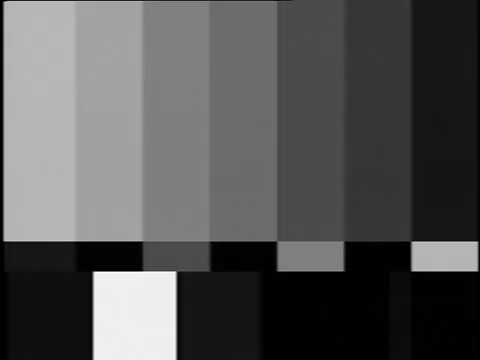

**Tone detection**: The audio track is decoded to 16 kHz mono and split into consecutive 250 ms chunks. Adjacent chunks are compared using cross-correlation; when their similarity stays at or above the tolerance (1.0 by default), the run is extended. Runs longer than the minimum duration (2000 ms by default) are reported as detected tones.

**Two-pass cross-validation**: Color bars and reference tone are typically authored together at the head of a tape, so the two detectors should largely agree. Each detector first scans the file independently. When one detector finds a span the other missed, a targeted windowed scan is re-run on the other detector with relaxed thresholds (bars: SSIM ≥ 0.6; tone: tolerance 0.7, minimum duration 500 ms), with ±5 seconds of slack around the trigger window since bars and tone don't always start and stop in lockstep. Second-pass rows are highlighted in the report; they are confirmation hits and never set the head-bars end time described below.

**Fragment merging**: A continuous span can dip below threshold briefly and be reported as several adjacent fragments; fragments separated by less than the configured merge gap (1 s for bars, 5 s for tone) are coalesced back into a single span.

**How the results are used**: CLAMS runs before qct-parse, and all detected bars and tone regions are passed to qct-parse, which runs additional windowed bars scans over them beyond the head of the tape. The head color-bars end time that drives the BRNG-skip window and the access-file trim is then merged from both detectors: when CLAMS's primary bars detection starts within the first 10 seconds of the file, the later of the two end times (qct-parse or CLAMS) wins — and if only one detector found head bars, its end time is used on its own. Only primary-pass CLAMS detections participate in this merge; mid-file bars are report-only.

Numeric tuning of the CLAMS parameters (SSIM threshold, sample ratio, minimum durations, etc.) is JSON-only — only the on/off toggle is exposed in the GUI and CLI. Edit the saved `last_used_checks_config.json` directly if you need to adjust those.

CLI: `av-spex --enable-clams-detection {on,off}`

---

## Video Signal Checks

### Detect Clamped Levels

Flags analog-to-digital converters that truncate the video signal at the broadcast (legal) range limits (via qct-parse). A clamped channel piles up at (or just inside) the limit value and never exceeds it, whereas an unclamped source shows excursions past the legal range caused by sync pulses, noise, or peak whites/superblacks.

Verdicts, reported per channel and direction:

- **Clamped** — enough frames sit at or near the broadcast limit (within the bit-depth tolerance) with zero excursions past it; the ADC is truncating the signal
- **Not Clamped** — one or more frames went past the limit; the signal is free to exceed broadcast range
- **Inconclusive** — the signal never reached the limit, so clamping cannot be determined from this content

Limits are derived from SMPTE broadcast-range values (bit-depth aware): 10-bit Y 64–940, U/V 64–960; 8-bit Y 16–235, U/V 16–240. The tolerance window scales with bit depth (8-bit: exact match required; 10-bit: ±2 codes). Measurements come from FFmpeg's `signalstats` filter as recorded in the QCTools report.

CLI: `av-spex --enable-clamped-levels {on,off}`

### Detect Chroma Phase Errors

Flags frames where the chroma signal has collapsed toward a single hue (typically cyan or magenta), usually caused by helical-scan tracking failures on tape sources (via qct-parse). The artifact is often accompanied by horizontal image displacement and a brief picture "swerve" at onset.

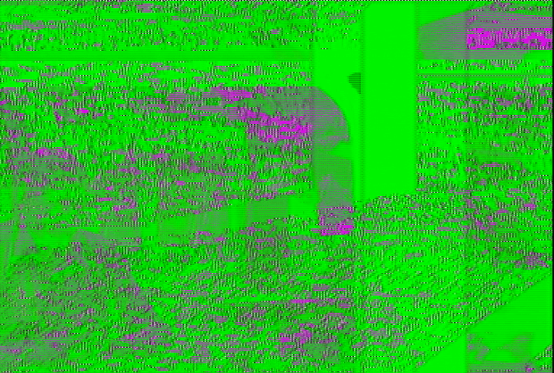

*A detected chroma phase error, from an event thumbnail in the HTML report: a tracking failure collapses the frame's chroma into a saturated field of complementary hues, with U and V spanning nearly their full range — the envelope signature described below.*

Two flagging rules:

- **Envelope** — within a single frame, both U and V span nearly the full chroma range (for 10-bit video: UMIN and VMIN below 100, UMAX and VMAX above 900; scaled for 8-bit). This is the strongest single-frame signature.
- **SATMAX** — the frame's maximum saturation exceeds 600 (10-bit) or its 8-bit equivalent. Catches partial events where only a portion of the frame is affected.

Consecutive flagged frames within ~10 frames are merged into a single event, and events shorter than 2 flagged frames are suppressed to filter isolated transients (scene cuts, motion blur into saturated content). Color bars at the head of the tape are skipped automatically when detected. Reported hue values are the median hue at the event's peak-saturation frame: ~180° is cyan, ~315° magenta.

CLI: `av-spex --enable-chroma-phase-detection {on,off}`

### Duplicate Frame Detection

Identifies runs of repeated frames likely caused by TBC or framesync error concealment during digitization. The detection pipeline:

- **QCTools candidate filter** — The QCTools report is scanned for runs of consecutive frames whose YDIF, UDIF, and VDIF values all fall below bit-depth-aware thresholds. Color bars, detected black segments, and flat-field frames (the deck's synthetic black output during signal loss, which is bit-identical frame to frame but is not frozen picture content) are excluded.
- **OpenCV verification** — Each candidate is verified by reading the actual frames and computing the mean squared error against the preceding frame. Candidates that don't confirm as near-identical are dropped.
- **Minimum run length** — A run of K consecutive low-diff frames represents a freeze of K+1 identical frames. The minimum run length is configurable (default 2, i.e. a freeze of 3 or more frames) to suppress single-frame matches that occur naturally on static content.

Detected runs are reported with their start time, duration, and length.

CLI: `av-spex --enable-duplicate-frame-detection {on,off}`

### Bitplane Check

Verifies that the 9th and 10th bits of 10-bit video contain data. Some TBC/framesync devices truncate these bits, producing what is effectively 8-bit video stored in a 10-bit container. The check flags clips where the least significant bits (bits  7th-10th) show no variation.

CLI: `av-spex --enable-bitplane-check {on,off}`

### Border Detection

Identifies the active picture area within the video frame, excluding non-content regions such as blanking intervals, head-switching noise, and pillarbox/letterbox borders. Accurately identifying borders matters because pixels in these regions are often outside broadcast range but do not represent actual content violations.

Two modes are available:

- **Simple** (default) — Applies a uniform fixed-pixel crop on all sides (default: 25 px). Also used as a fallback when sophisticated detection is not possible.
- **Sophisticated** — Samples multiple frames across the video, selecting high-quality frames with good contrast, and analyzes luminance gradients at the frame edges to find where active picture content begins. Also detects head-switching artifacts in the bottom rows of the frame; if the average artifact height exceeds the luminance-based bottom border crop, the bottom crop is expanded to match.

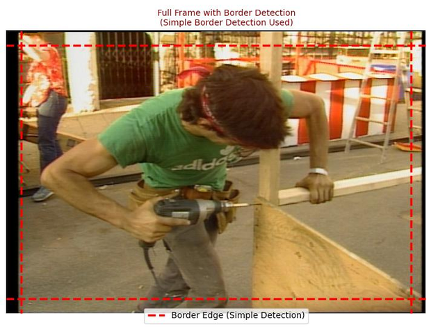

*Simple border detection as shown in the HTML report: a fixed 25 px border (dashed line) is cropped from every edge, excluding blanking regions — like the black bar at the left edge of this frame — from broadcast-range analysis.*


*Sophisticated border detection on the same tape: edge analysis sizes each border independently (here L=36 px, R=18 px, T=7 px, B=14 px — shaded red) instead of applying a uniform crop, and the detected head-switching region at the bottom of the frame (orange, 9 px) is excluded as well.*

**Iterative refinement**: After initial border detection, BRNG analysis runs on the detected active area. If a high percentage of violations occur at the edges of the active area — suggesting the borders were not cropped aggressively enough — the borders are automatically expanded and the analysis is re-run, up to the configured maximum number of retries. The goal is to separate true content violations from border artifacts.

Border Detection is required for Signalstats Analysis, and the detected active area can also be used to crop the access file (**Crop Borders** output option).

CLI: `av-spex --enable-border-detection {on,off}`, `--frame-borders {simple,sophisticated}`, `--frame-border-pixels 25`

### Signalstats Analysis

Evaluates broadcast-range compliance across sampled time periods of the video using the FFmpeg `signalstats` BRNG metric — the fraction of pixels in each frame that fall outside the broadcast-legal range (for 8-bit video: luma below 16 or above 235, chroma below 16 or above 240).

**Dual-source comparison**: When Border Detection has identified an active picture area, two parallel analyses run for each period to distinguish border artifacts from actual content violations:

1. **QCTools (full frame)** — BRNG values parsed from the QCTools report, covering the entire frame including borders and blanking areas
2. **FFprobe (active area only)** — BRNG values computed with a crop filter applied, so only the detected active picture area is analyzed

Comparing the two reveals whether violations originate from border/blanking regions or from the picture content itself: if the full frame shows significantly more violations (>5%) than the active area, they are classified as *border violations*; if the active area itself shows >10% violations, they are classified as *content violations* that may require correction. The final diagnosis is based on the active-area results — the picture content that would actually be seen in playback or broadcast.

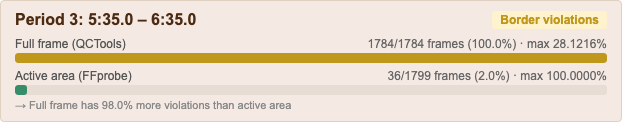

*A one-minute analysis period as shown in the HTML report. The full frame flags BRNG violations on every frame, but the active picture area flags only 16.2% — so the period is classified as border violations rather than content violations.*

**Period selection**: Analysis periods target, in priority order: timestamps where QCTools detected the highest concentrations of BRNG activity, timestamps flagged during border detection as having interesting signal characteristics, and finally evenly spaced periods across the content (after color bars).

CLI: `av-spex --enable-signalstats {on,off}`

### BRNG Analysis

**BRNG (Broadcast Range)** measures whether pixel values fall outside the broadcast-legal range (16–235 for luma, 16–240 for chroma in 8-bit video). Pixels outside this range may be clipped during broadcast or indicate issues in the source material.

**Differential detection**: For each analysis period, two temporary video segments are created from the active picture area — one rendered with FFmpeg's `signalstats=out=brng:color=magenta` filter, which overlays magenta on out-of-range pixels, and one rendered without it.

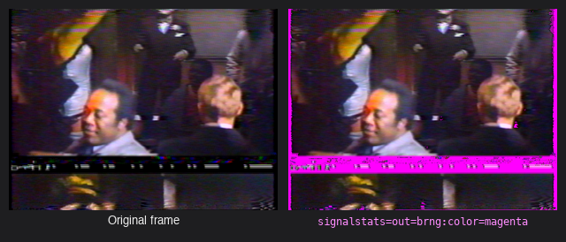

*The same frame from the two rendered segments. On the right, the `signalstats` filter paints out-of-range pixels magenta — here a dropout band crossing the picture, a hot highlight, and violations along the frame edges.*

Frames are then compared pixel-by-pixel using three independent detection methods that vote on whether a pixel is a genuine violation:

1. **BGR threshold** — checks for the magenta color signature (high red + blue, low green channel differences)
2. **Ratio-based** — verifies that red and blue channel increases are proportional, characteristic of the magenta overlay
3. **HSV analysis** — confirms the magenta hue range with a saturation increase

A pixel is classified as a violation only when at least 2 of the 3 methods agree, and small isolated clusters (fewer than 10 connected pixels) are filtered out as noise.

**Violation classification**: Each frame with detected violations is classified by spatial pattern — *sub-black* (violations concentrated in low-luma zones), *highlight clipping* (high-luma zones), *edge artifacts* (within 15 px of frame edges, suggesting border/blanking issues), *linear blanking patterns* (edge violations forming continuous horizontal or vertical lines), or *general broadcast range violations*.

**Adaptive detection**: When signalstats results are available, periods diagnosed as border-dominated or minimal use stricter detection thresholds to reduce false positives, while periods with content violations use standard sensitivity. When head-switching artifacts were detected during border detection, the bottom-edge analysis zone is widened so head-switching noise is classified as edge artifacts rather than content violations.

Options: **Duration Limit** caps how much of the video is analyzed (default: 300 seconds), and **Skip Color Bars** excludes the detected color-bars section from analysis.

CLI: `av-spex --enable-brng-analysis {on,off}`, `--frame-brng-duration 300`, `--frame-no-colorbar-skip`

### Analysis Periods

The number and length of the time windows sampled across the video, shared by Signalstats Analysis and BRNG Analysis (default: 3 periods of 60 seconds each). Because the differential BRNG detector decodes and compares video frames with computer-vision analysis on every sample, neither check examines the whole tape — this targeted sampling keeps processing time manageable while concentrating analysis on the frames most likely to contain violations. Period count multiplied by period duration is effectively the runtime dial for frame analysis: every period costs two full decodes of its length.

Because only a few minutes of a tape are actually examined, *where* those periods land determines whether the report describes the tape's real problems or an arbitrary slice of it. The guiding principle is that periods should land where the QCTools report says the out-of-range pixels actually are, and never on content that can't be meaningfully analyzed.

**How periods are placed**: The QCTools report is scanned once and every frame with out-of-range pixels (BRNG above a small threshold) is tallied into 10-second bins. Bins are ranked by how severe their violations are — total severity rather than a simple frame count, because on a noisy tape nearly every frame in many bins violates and counts all tie at the top. Periods are then placed on the densest bins first, centered on the bin. A first pass requires each new period to sit at least two period-lengths away from the ones already chosen, so the periods cover distinct problem areas instead of stacking on a single burst; if that leaves too few periods — a tape whose problems really are all in one place — the spacing requirement relaxes to simple non-overlap.

**What is excluded**: Detected head color bars plus a 10-second margin, mid-file color bars, detected all-black segments, and the last 30 seconds of the file (end-of-tape static). Black is excluded because analog tape black carries sub-black noise that would otherwise dominate every violation list, and bars are excluded because standard SMPTE bars themselves measure marginally outside broadcast range — left in, a test pattern reads as a dense violation cluster and attracts every period.

**Repairs**: A period that ends up overlapping bars or black by more than a quarter of its length is shifted outward in 5-second steps, alternating forward and backward, until it finds a position that overlaps by 10% or less and stays clear of the other periods. If no such position exists, the period is shrunk to fit the largest clean gap in the content (down to a 10-second minimum) — this is what happens on short tapes whose entire non-black content is shorter than one configured period. A period that can't be repaired either way is dropped.

**When there are no violations to aim at**: On a clean tape the placement falls back to periods centered on frames that border detection found visually clean, and failing that to periods spread evenly across the content. If violation clustering or the repair pass left fewer periods than requested, the count is topped up with evenly spaced periods that avoid the existing ones, so the report always samples the requested number of places.

**Refinement**: Signalstats runs on the selected periods first, and its findings can revise the periods before BRNG analysis runs. A period whose active picture area turns out to hold essentially no out-of-range signal — nothing for the differential detector to find — is swapped for the next-best unused candidate. Each period's diagnosis also sets how densely BRNG analysis samples it: periods with real content violations are sampled heavily, near-clean periods lightly.

**Where the periods appear**: In `{video_id}_enhanced_frame_analysis.json` (alongside the detected black segments) and as the shaded tan bands on the color bars evaluation timeline in the HTML report. The timeline's dashed BRNG trace is the same measure that drives period placement, so the trace's peaks and the shaded bands should visibly coincide.

Both settings are configured on the Complex tab; they are not exposed as CLI flags — to change them outside the GUI, edit the saved config file.

---

## Audio Checks

### Audio Analysis

Enables five audio detections that read the QCTools report (via qct-parse): **clipping**, **channel imbalance**, **identical channels**, **audible timecode**, and **audio dropout** — each described below. Results are written to CSVs in `_report_csvs/`, the per-file log, and the HTML report.

For inputs with more than one audio stream (e.g. discrete mono tracks), the QCTools report only carries a downmix, so AV Spex generates a per-stream audio stats sidecar (`{video_id}.audio_stats.xml.gz` in `_qc_metadata/`) and analyzes that instead, so every stream is covered.

CLI: `av-spex --enable-audio-analysis {on,off}` (auto-enables qct-parse if needed)

### Audio Clipping

Scans the audio frames to identify moments where the signal reaches or exceeds digital full scale, indicating the original analog signal may have been too hot during digitization.

Metrics used (both from FFmpeg's `astats` filter as recorded in the QCTools report):

- **Peak Level (dBFS)** — The peak sample value per audio frame, in decibels relative to full scale. A value of 0.0 dBFS means the signal hit the absolute digital maximum; frames at or above the threshold (−0.5 dBFS) are flagged as clipped.
- **Flat Factor** — How many consecutive audio samples share the same value. When the signal clips, it is clamped at the digital ceiling, producing runs of identical samples. A Flat Factor of 1–10 is normal in any audio; values above 100 at near-peak levels indicate sustained clipping where the waveform is flattened for extended periods.

Peak Level identifies *whether* clipping occurred; Flat Factor indicates *how severe* it is.

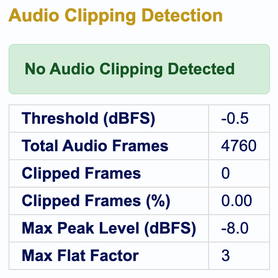

### Channel Imbalance

Compares the average loudness of each audio channel across the entire program to characterize level differences between channels, using the mean RMS level (dBFS) per channel from FFmpeg's `astats` filter.

Characterization:

- **Balanced** — less than 1 dB difference between channels
- **Slight imbalance** — 1–3 dB difference; common with analog sources and generally not a concern
- **Moderate imbalance** — 3–6 dB difference; may indicate a level calibration issue with the playback or capture equipment
- **Significant imbalance** — greater than 6 dB difference; could indicate a hardware fault, bad cable, or a mono source recorded to only one channel

It is not uncommon for one channel to be somewhat louder than the other on analog source material. This analysis is informational — it characterizes the file rather than flagging an error.

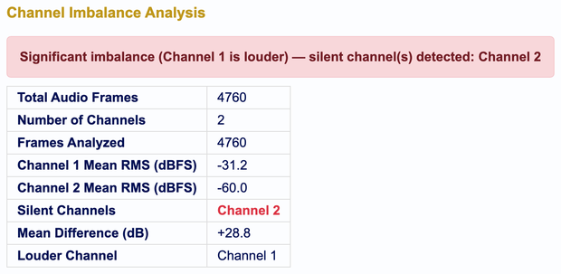

### Identical Channels (Dual Mono)

Detects audio channels that carry the same content — a file that is stereo in form but mono in substance. This is common on analog transfers where a mono source was patched to both inputs, or where one channel was duplicated during the transfer. Knowing a file is dual mono matters when deciding whether both channels need to be preserved and when excluding channels from the access copy. The detection runs as part of Audio Analysis; there is no separate toggle.

Detection is two-stage, because matching levels alone are only circumstantial evidence:

**1. Screening** — Every pair of channels is compared on measurements already present in the QCTools report: the per-channel RMS level from `astats` and, for stereo files, the inter-channel phase correlation from `aphasemeter`. A frame counts as matching when the two channels' levels agree within 0.1 dB and the phase correlation is essentially ±1. Frames where the loudest channel is at or below the silence floor are skipped — silence matches silence trivially — and matching runs shorter than 5 seconds are not reported as regions. If 99% or more of the frames with audio match, the pair is a whole-file candidate; between 10% and 99%, it is a partial candidate and the longest matching run is carried forward. Some QCTools reports may carry no `aphasemeter` data; the screen then relies on the level comparison alone, and the report's Phase column reads N/A.

**2. Confirmation** — Candidate pairs are decoded through FFmpeg and compared sample by sample, measuring both the **difference** (A−B) and the **sum** (A+B) of the two channels. The sum is what separates a straight duplicate from a polarity-inverted one, which the QCTools measurements cannot tell apart. Whole-file candidates are compared across the entire file; partial candidates only over their longest matching region. Confirmation is authoritative — if the samples show the channels genuinely differ, the result is *Distinct channels* despite the matching levels. On files with many channels, at most three pairs are confirmed this way so the check can't turn into a pile of decodes.

Results:

- **Bit-identical** — the difference between the channels is digital silence; the two channels are the same samples
- **Effectively identical** — the difference sits at least 30 dB below the program's own peak: the same audio twice, with only rounding or a hair of level offset between the copies
- **Polarity-inverted duplicate** — the same audio with the polarity of one channel flipped, so the two sum to silence rather than cancelling in the difference
- **Partially identical** — the channels duplicate each other over part of the file only; the matching regions are listed with start and end positions in the file's own timecode
- **Distinct channels** — genuinely different content on each channel
- **Insufficient audio** — too few frames with audio above the silence floor to say either way

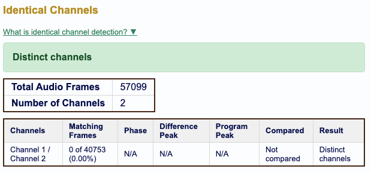

*The Identical Channels section of the HTML report, here for a file with genuine stereo content: none of the 40,753 frames with audio showed matching levels, so the pair never reached the confirmation stage — hence the "Not compared" region and the N/A measurement columns. A dual mono file would instead report a verdict of "Identical channels (dual mono)", with a difference peak at or near digital silence.*

Full results, including the per-pair measurements and any matching regions, are written to `qct-parse_identical_channels.csv`.

### Audible Timecode (LTC)

Scans the audio for Linear Timecode (LTC) artifacts — a biphase-modulated square wave (~2400 Hz for 30 fps NTSC) that was recorded on an audio track during the original production or dubbing process.

Rolling windows over the audio measurements look for the characteristic statistical fingerprint of LTC: steady RMS level, low crest factor (square-wave shape), narrow dynamic range, and a zero-crossing rate consistent with the LTC carrier frequency. Three patterns are detected:

- **Stable mix at TC level** — the mix loudness sits steadily at LTC level with narrow dynamic range (fires both when both channels carry TC and when one channel carries TC with a quiet other channel)
- **TC + silence** — one channel carries timecode while the other is near-silent
- **TC + program audio** — timecode is present alongside program audio on separate channels

Detections must persist across multiple consecutive windows to be reported, reducing false positives from transient audio events, and overlapping detections are collapsed into **consensus regions** — one row per contiguous span of audible timecode. Per-channel `astats` boundaries are authoritative; EBU R128 loudness measurements corroborate, and an R128-only detection with no `astats` corroboration is discarded, since loudness statistics alone can't tell LTC from other steady-loudness audio (e.g. heavily compressed music).

Region start and end positions are shown as non-drop-frame timecode (`HH:MM:SS:FF`) at the video frame rate, so they match what an NLE displays.

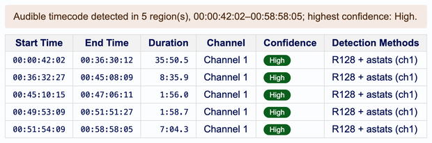

### Audio Dropout

Identifies moments where the audio signal level drops suddenly and significantly — characteristic of tape dropout during analog playback. A rolling window of audio frames (7 frames, ~11 seconds) establishes a local baseline, and frames that fall far below it are flagged.

- **RMS Level (dBFS)** — The primary trigger: a frame is flagged when its RMS level drops more than 40 dB below the rolling median. Frames where the median itself is below −55 dBFS are ignored to avoid false positives in naturally quiet content.
- **Max Difference / RMS Difference** — Spikes in sample-to-sample jumps corroborate a click or signal discontinuity at the dropout boundary.
- **Zero Crossings Rate** — Very low values indicate silence; very high values may indicate noise bursts.

Confidence is **High** (RMS drop plus two or more corroborating metrics), **Medium** (one corroborating metric), or **Low** (RMS drop only). Detection runs per audio channel to catch single-channel dropouts.

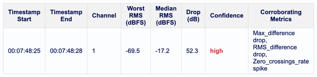

### Tone Leak Detection

Flags a continuous ~1 kHz calibration/reference tone leaking from the transfer chain into the recorded audio — heard as a faint high-pitched whine or squeak during quiet passages. Because the leaked tone is distorted, it leaves a harmonic comb at exact multiples of 1 kHz (1000, 2000, 3000, 4000, 6000 Hz) that stands far above the surrounding spectral floor even when the tone is well below program level.

Audio is decoded directly from the video file (not read from the QCTools report) and analyzed independently for every stream and channel in 8-second FFT windows. Each window's **comb score** is the average level of the harmonics above their local spectral floor; a channel is flagged when enough windows score at or above 12 dB. Digitally silent stretches are excluded, and flagged regions are reported in the file's own timecode.

CLI: `av-spex --enable-tone-leak-detection {on,off}`

### Dropped Sample Detection

Identifies potential audio sample drops caused by TBC/framesync devices or analog-to-digital converters during digitization. Two indicators are analyzed:

- **Spectrogram spike analysis** — A spectrogram of the full audio is generated with FFmpeg. Bright vertical lines spanning the entire frequency range indicate audible pops/clicks from dropped samples; the image is analyzed programmatically to detect and count these spikes.
- **Audio/video duration mismatch** — Dropped samples cause the audio stream to be slightly shorter than the video stream, so any measurable difference between the two durations is flagged.

Both signals are combined into a weighted risk score, escalated when both indicators are present. The spectrogram, spike count, estimated loss, and spike timestamps are included in the HTML report.

CLI: `av-spex --enable-dropped-sample-detection {on,off}`

---

## CLI Usage

```bash
av-spex [path/to/directory]
```

### Options

`av-spex --help` prints the full reference grouped by category (Config profiles, Config import/export, Tool toggles, qct-parse / CLAMS, Frame analysis, Input settings, Output settings, Fixity).

**Processing profiles:**
- `--profile {step1,step2,off,vendor}` — Apply a predefined processing profile (see the Checks Tab section above for details on each profile)

**Tool toggles:**
- `--on / --off` — Enable or disable individual tool options without affecting others. Format: `tool.run_tool` or `tool.check_tool` (e.g., `--on mediainfo.run_tool --on mediainfo.check_tool`)
- `--mediaconch-policy FILE` — Import a custom MediaConch XML policy file

**Spex profiles:**
- `--signalflow / -sn` — Select a signal flow equipment profile by name
- `--filename / -fn` — Select a filename convention profile by name
- `--exiftool-profile` — Apply a named ExifTool expected-values profile
- `--mediainfo-profile` — Apply a named MediaInfo expected-values profile
- `--ffprobe-profile` — Apply a named FFprobe expected-values profile
- `--exiftool-from-file FILE` / `--mediainfo-from-file FILE` / `--ffprobe-from-file FILE` — Create a new expected-values profile from a tool's raw output file (saves and applies it)

**qct-parse / CLAMS feature toggles:**
- `--enable-audio-analysis {on,off}` — Toggle qct-parse audio analysis (clipping, channel imbalance, identical channels, audible timecode, dropout). Auto-enables qct-parse if needed.
- `--enable-clamped-levels {on,off}` — Toggle broadcast-range level clamping detection. Auto-enables qct-parse if needed.
- `--enable-chroma-phase-detection {on,off}` — Toggle chroma phase error detection. Auto-enables qct-parse if needed.
- `--enable-tone-leak-detection {on,off}` — Toggle 1 kHz reference-tone leak detection. Auto-enables qct-parse if needed.
- `--enable-clams-detection {on,off}` — Toggle CLAMS SSIM bars + cross-correlation tone detector
- `--evaluate-bars-reference {detected,smpte}` — What Evaluate Color Bars grades against: this file's own detected bars (default) or standard SMPTE values. Only takes effect when Evaluate Color Bars is on.

**Frame analysis:**
- `--enable-bitplane-check {on,off}` — Toggle the 9th/10th bit verification
- `--enable-border-detection {on,off}` — Toggle active picture area detection
- `--enable-brng-analysis {on,off}` — Toggle differential BRNG analysis
- `--enable-signalstats {on,off}` — Toggle signalstats analysis (requires border detection)
- `--enable-dropped-sample-detection {on,off}` — Toggle dropped audio sample detection
- `--enable-duplicate-frame-detection {on,off}` — Toggle duplicate/frozen frame detection
- `--frame-borders {simple,sophisticated}` — Border detection mode
- `--frame-border-pixels N` — Pixels cropped from each edge in simple border mode (default: 25)
- `--frame-brng-duration SECONDS` — Maximum duration analyzed by BRNG analysis (default: 300)
- `--frame-no-colorbar-skip` — Analyze the detected color bars instead of skipping them

**Input settings:**
- `--video-file-extension {mkv,mov,mp4,avi,mxf}` — Which container to look for in the input directory (default: `mkv`). A non-MKV selection automatically turns off embedded stream fixity and the mediatrace custom-tag check, and skips the ffprobe signal flow (`ENCODER_SETTINGS`) check, since those only work on Matroska.

**Output settings:**
- `--access-trim-color-bars {on,off}` — Skip head color bars in the access file
- `--access-crop-borders {on,off}` — Crop the access file to the active picture area (requires `--access-crop-to-480 on`)
- `--access-crop-to-480 {on,off}` — Trim NTSC sources to 720x480; off keeps native 720x486
- `--access-exclude-flagged-audio {on,off}` — Exclude a channel flagged as silent or carrying audible timecode from the access file, outputting the good channel as dual mono (default: off; requires `--enable-audio-analysis on`)
- `--qctools-ext {qctools.xml.gz,qctools.mkv}` — QCTools output extension

**Fixity:**
- `--checksum-algorithm {md5,sha256}` — Hash algorithm for whole-file fixity (output / validate)
- `--stream-hash-algorithm {md5,sha256}` — Hash algorithm for embedded stream fixity

**Config management:**
- `--printprofile / -pp` — Print current config values. Accepts: `all`, `spex`, `checks`, `checks,outputs`, `checks,fixity`, `checks,tools`, `spex,filename_values`, `exiftool`, `mediainfo`, `ffprobe`, `signalflow`
- `--export-config {all,spex,checks}` — Export current config(s) to JSON
- `--export-file FILENAME` — Specify output filename for `--export-config`
- `--import-config FILE` — Import config from a previously exported JSON file
- `--export-mediaconch-policy [DEST]` — Export the current MediaConch policy XML so it can be shared. Takes an optional destination file or directory; with no argument it writes to the current directory.
- `--use-default-config` — Reset all configs to defaults

**Other:**
- `-d / --directory` — Indicate that the input paths are directories
- `-f / --file` — Indicate that the input paths are video files
- `-dr / --dryrun` — Apply config changes without processing any video files
- `--gui` — Force launch in GUI mode
- `--version` — Print the AV Spex version and exit

---

## Configuration

AV Spex's settings are stored in two primary JSON config files, editable through the GUI or CLI: the Checks config and the Spex config. Custom profiles live in their own files alongside them — filename profiles, signal flow profiles, and any custom ExifTool, MediaInfo, or FFprobe expected-value profiles you create. All of them are saved in the user config directory, so your settings persist across sessions and survive an application update.

### Checks Config

Controls which tools run and what outputs are generated.

**Outputs**
- `access_file` — Create a low-resolution MP4 access copy
- `access_file_trim_color_bars` — Skip head color bars in the access file (requires qct-parse bars detection)
- `access_file_crop_borders` — Crop the access file to the detected active picture area (requires `access_file_crop_to_480: true`)
- `access_file_crop_to_480` — Trim NTSC to 720x480 (default `true`); set to `false` to keep native 720x486
- `access_file_exclude_flagged_audio` — Leave flagged audio channels out of the access copy: a channel found silent or carrying audible timecode is dropped, and dual mono is built from the good channel (default `false`; requires audio analysis)
- `report` — Generate an HTML summary report
- `qctools_ext` — Output extension for QCTools files (`qctools.xml.gz` or `qctools.mkv`)
- **Frame Analysis** settings: `enable_bitplane_check`, `enable_border_detection`, `enable_brng_analysis`, `enable_signalstats`, `enable_dropped_sample_detection`, `enable_duplicate_frame_detection`, `border_detection_mode` (simple/sophisticated), `simple_border_pixels` (default: 25), `brng_duration_limit` (default: 300 seconds), `brng_skip_color_bars`, `analysis_period_duration` and `analysis_period_count` (the periods shared by signalstats and BRNG analysis), `duplicate_min_run_length` (default: 2), plus sophisticated-border tuning fields and the border retry settings `auto_retry_borders` / `max_border_retries`

**Fixity**
- `output_fixity` — Write checksums to a fixity text file
- `check_fixity` — Validate against stored checksums
- `embed_stream_fixity` — Embed video/audio stream hashes into MKV tags
- `validate_stream_fixity` — Validate against embedded stream hashes
- `overwrite_stream_fixity` — Overwrite existing embedded hashes
- `checksum_algorithm` — Hash algorithm for whole-file fixity (`md5` or `sha256`)
- `stream_hash_algorithm` — Hash algorithm for embedded stream fixity (`md5` or `sha256`)

**Tools** — Each tool has `run_tool` and/or `check_tool` toggles:
- `exiftool`, `ffprobe`, `mediainfo`, `mediatrace`, `mkvalidator`: `run_tool` and `check_tool` (mkvalidator only applies to MKV inputs and is skipped for other containers)
- `mediaconch`: `run_mediaconch` and `mediaconch_policy` (path to XML policy file)
- `qctools`: `run_tool`
- `qct_parse`: `run_tool`, `barsDetection`, `evaluateBars`, `evaluateBarsReference` (`detected` or `smpte`), `thumbExport`, `audio_analysis`, `detect_clamped_levels`, `detect_chroma_phase_errors`, `detect_tone_leak`
- `clams_detection`: `run_tool` (numeric `bars` and `tone` sub-parameters are JSON-only)

**Input settings**
- `video_file_extension` — Which container AV Spex looks for in an input directory: `mkv` (default), `mov`, `mp4`, `avi`, or `mxf`. Embedded stream fixity and the custom Matroska tag checks only apply to MKV.
- `validate_filename` — Check input filenames against the active filename profile

### Spex Config

Stores expected metadata values organized by tool. Multiple acceptable values are supported using a list:
```json
"codec_name": ["flac", "pcm_s24le"]
```

Sections include: `filename_values`, `mediainfo_values` (general, video, audio track values), `exiftool_values`, `ffmpeg_values` (video stream, audio stream, format values), `mediatrace_values` (custom MKV tags like `ENCODER_SETTINGS`), `qct_parse_values` (color bar thresholds and content filter definitions), and `signalflow_profiles` (the equipment signal chain profiles selectable from the Spex tab).

### Managing Configs

To export or import configurations:
```bash
av-spex --export-config all --export-file my_config.json
av-spex --import-config my_config.json
```

Configs can also be imported, exported, and reset from the Import tab in the GUI.

**Example: editing a setting that isn't in the GUI or CLI.** Some tuning parameters are deliberately JSON-only — the sophisticated border detection parameters, the CLAMS bars and tone numerics, and the duplicate frame detector's minimum run length. The export/import round trip is the safest way to change one: export the current settings, edit the file, and import it back.

Suppose duplicate frame detection is reporting too many short freezes and you want it to flag only runs of five or more identical frames. First export the Checks config:

```bash
av-spex --export-config checks --export-file my_checks.json
```

The exported file wraps everything in a top-level key naming the config, so `my_checks.json` looks like this (abridged):

```json
{
  "checks": {
    "outputs": {
      "access_file": false,
      "report": true,
      "qctools_ext": "qctools.xml.gz",
      "frame_analysis": {
        "enable_duplicate_frame_detection": true,
        "duplicate_min_run_length": 2
      }
    },
    "fixity": { "...": "..." },
    "tools": { "...": "..." }
  }
}
```

Change `duplicate_min_run_length` from `2` to `4` — the value is the number of consecutive low-difference frames, so a run of 4 means a freeze of 5 identical frames — save the file, and import it:

```bash
av-spex --import-config my_checks.json
```

Confirm the change took effect, then process as usual:

```bash
av-spex -pp checks,outputs
av-spex /path/to/video_files
```

A few things to keep in mind when editing a config by hand:

- **Edit an exported file rather than writing one from scratch.** Importing replaces the whole section it contains, so starting from a full export keeps every field you didn't mean to change.
- **Booleans are `true` and `false`**, not `"yes"` and `"no"` — older configs using the string form are converted automatically on load, but new edits should use real JSON booleans.
- **The top-level key has to match the config type** (`checks` or `spex`); a file exported with `--export-config all` contains both.
- **An import is applied immediately and persists**, exactly as if you had made the change in the GUI. Use `--use-default-config` to get back to the shipped defaults if an edit goes wrong.

---

## Outputs

For each processed input directory `{video_id}/`:

- **`{video_id}_qc_metadata/`** — Sidecar metadata files (ExifTool, FFprobe, MediaConch, MediaInfo, MediaTrace, QCTools), fixity files, and a per-file log
- **`{video_id}_report_csvs/`** — CSV files used to populate the HTML report
- **`{video_id}_avspex_report.html`** — HTML summary report
- **`{video_id}_vrecord_metadata/`** — Legacy vrecord metadata, moved here if present

### Logging

A per-file log is written inside each `_qc_metadata` directory:
`{video_id}_qc_metadata/{video_id}_avspex_processing.log`
Re-running a file appends to its existing log rather than overwriting it, so the full processing history of the file is preserved in one place. Each new run is separated from the previous one by a `NEW PROCESSING RUN` banner, followed by the run's start timestamp.

Each run also writes a timestamped application log:
```
/.../Library/Logs/AVSpex/YYYY-MM-DD/YYYY-MM-DD_HH-MM-SS_JPC_AV_log.log
```

---

## Acknowledgements

AV Spex makes use of code from several open source projects, including [loglog](https://github.com/amiaopensource/loglog), [qct-parse](https://github.com/amiaopensource/qct-parse), and [IFIscripts](https://github.com/kieranjol/IFIscripts). Attribution and copyright notices are included as comments inline where open source code is used, and full license texts are included in the project README.

AV Spex is distributed under the GNU General Public License v3.0.
